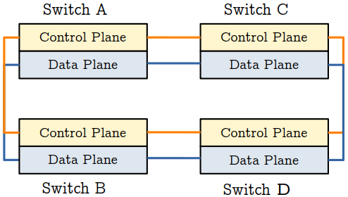
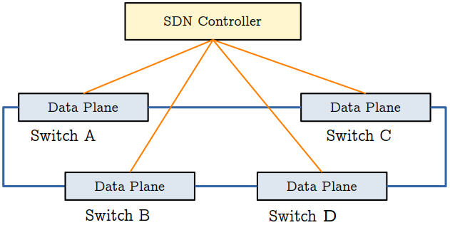
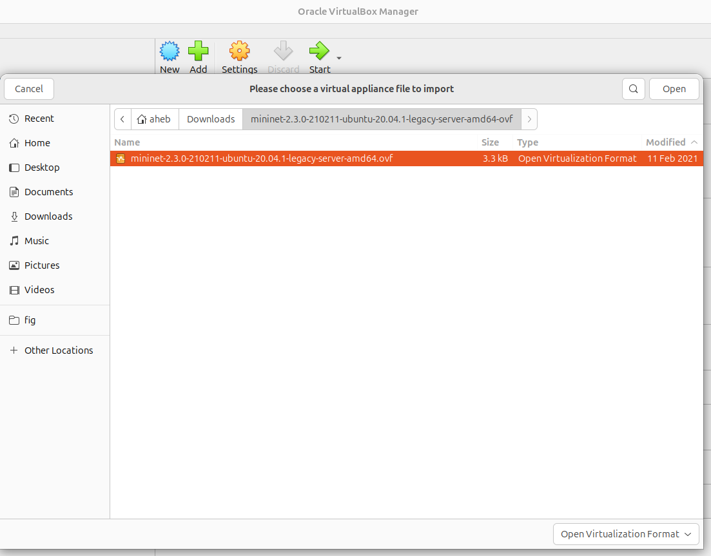

# 1. Software Defined Networking
Switches and routers play a critical role in enterprise networks. Traditionally, these network devices have been responsible for deciding which path packets should follow, as well the actual data trasnfer (forwarding). In other words, the control and data flow functionalities of the network devices have been dealt with at each swithch and router, individually. While *control* refers to determining step-by-step movement of a given packet from source to destination, *forwarding* means the flow of data packets from the source to the destination. In tradtional computer networks, switches and routers are responsible for both the control and data forwarding functions. As shown in **Figure 1**, control and data planes in traditional switches are distributed across the network.

<p align="center">
  
</p>
<p align="center"><strong>Figure 1:</strong> Traditional switches with control and data planes.</p>


Notably, the control plane is distributed across the network in traditional network architecture. However, the merger of control and data forwarding planes has been found to be inefficient. Therefore, to address the limitations of network architectures based on traditional switches, Software Defined Networking (SDN) was proposed nearly two decades ago.  SDN moves the control plane out of individual switches to create a centralized network control architecture. **Figure 2** shows the separation of control and data planes in SDN based architecture. Centralized control is handled by an **SDN Controller**, which is responsible for deciding which particular paths packets take in the network. Based on routing decisions made by the SDN controller, the actual data forwarding is made by individual switches by the data plane in each.

<p align="center">
  
</p>
<p align="center"><strong>Figure 2:</strong> SDN switches with centralized control plane.</p>

In other words, all the control functionality in traditional switches has been moved to the SDN Controller. Notably, the data plane part is retained by individual switches in the network architecture. As a results, the switches in an SDN based network focus on data forwarding according to the instructions they receive from the SDN Controller.


# 2. Mininet
Mininet is a network emulator software. It is used to create an SDN network using virtual hosts, switches, and SDN controller(s). Due to its ease of use and software-based implementation, Mininet is great for experimenting with SDN, OpenFlow, SDN controllers, and SDN applications. While there are also other SDN emulation software, Mininet is one of the most widely ones.
## 2.1. Setting Up Mininet
Mininet is available for common operating systems (OSes), including Linux, macOS and Windows. There are multiple ways to install Mininet in each of the OSes. Among these, the most foolproof method is to install a pre-packaged Mininet Virual Machine (VM) image in a virtualization systems such as [VirtualBox](https://www.virtualbox.org/) and [VMWare](https://www.vmware.com/). This is a Mininet tutorial for an Ubuntu Linux-based environment on VirtualBox. The steps can be adopted to other Linux distributions with minimum customization.
1. Install VirtualBox by downloading it from https://www.virtualbox.org/wiki/Linux_Downloads
Assuming the VirtualBox software is saved to **Downloads** directory in Ubuntu, use the following commands to install it.
  ```bash
  cd Downloads/ # Navigate to Downloads directory
  sudo dpkg -i virtualbox-7.1_7.1.8-168469~Ubuntu~noble_amd64.deb # Install VirtualBox VM
  sudo apt install virtualbox-dkms
  sudo apt install virtualbox-guest-additions-iso
  sudo apt install virtualbox-guest-utils-hwe
  ```

2. Download [Mininet VM image for Ubuntu 20.04.1](https://github.com/mininet/mininet/releases/download/2.3.0/mininet-2.3.0-210211-ubuntu-20.04.1-legacy-server-amd64-ovf.zip), which is the recommended one by the maintainers.
If you prefer any of the earlier Mininet realeases for any reason, you can download it from [Older Mininet VM image for Ubuntu](https://github.com/mininet/mininet/releases/).

3. Install Mininet in VirtualBox and setup remote access to Mininet according to the following steps.
 A. Import Mininet to VirtualBox (File --> Import Appliance) as shown in **Figures 3**. 
<figure>
<table>
  <tr>
    <td>
      <br>
    </td>
    <td>
      <br>
    </td>
  </tr>
</table>
<figcaption><strong>Figure 3: </strong> Mininet Installation in VirtualBox </figcaption>
</figure>
 B. On VirtualBox, configure the Mininet VM so that you can login to it from your local machine using **ssh**.
 While there are other ways to connect to the VM, Bridged Adapter is enables the Mininet VM to directly connect to the physical network via the host’s network card, such as Ethernet and Wi-Fi. In this way, the Mininet VM appears as a separate device on the local area network (LAN), with its own IP address.
 To configure a Bridged Adapter in VirtualBox, go to Settings --> Network --> Adapter 1 --> Enable Network Adapter --> Attached to --> **Bridged Adapter**.
 C. Select the Mininet VM in VirtualBox, and click **Start**.
 D. Log in to Mininet using the default log in details, i.e. **username: mininet**, **password: mininet**.

4. After logging in to Mininet, configure it for remote access.
 On the Mininet VM terminal, set up an interface (**eth1**) as follows.
  ```bash
  sudo dhclient eth1 # Run DHCP for eth1 interface
  ifconfig eth1 # See and note the IP address for eth1.
  ```
  Note the IP address obtained from **ifconfig** because it will be used for remote login to your Mininet VM. The computer where this tutorial is been created has an IP address of **192.168.0.8**. Therefore, that IP will be used for connecting to Mininet using ssh.
5. On your loacl machine, use **ssh** to remotely access the Mininet VM.
  ```bash
  ssh -X mininet@192.168.0.8
  ```
These basic configurations will enable you to access you Mininet VM from any computer on your local network. First, ensure the Mininet VM has been started. Second, you can login to Mininet using **ssh -X mininet@192.168.0.8** by replacing the IP address with the IP address assigned to your local Mininet VM.

-- Mininet Walkthrough: https://mininet.org/walkthrough/
Software Defined Networking 

# Dataset
### Download the CSV files of the UNSW-NB15 dataset from [CSVs](https://cloudstor.aarnet.edu.au/plus/index.php/s/2DhnLGDdEECo4ys?path=%2FUNSW-NB15%20-%20CSV%20Files). 

Move the downloaded CSV files to the **unsw_nb15_dataset** project subdirectory as shown below.
  ```bash
  mkdir data
  cd data
  mkdir unsw_nb15_dataset
  mv /path/to/UNSW-NB15-CSV-FILES/* ./unsw_nb15_dataset/
  ```

### Download the PCAP files of the UNSW-NB15 dataset from [PCAPs](https://cloudstor.aarnet.edu.au/plus/index.php/s/2DhnLGDdEECo4ys?path=%2FUNSW-NB15%20-%20pcap%20files/).

Move the PCAP files inside **pcaps 17-2-2015** and **pcaps 22-1-2015** to **feb_pcap** and **jan_pcap** project subdirectories, respectively, as shown below.
  ```bash
  mkdir feb_pcap
  mv /path/to/pcaps 17-2-2015/* ./feb_pcap # UNSW-NB15 PCAPs in February
  mkdir jan_pcap
  mv /path/to/pcaps 22-1-2015/* ./jan_pcap  # UNSW-NB15 PCAPs in January
  ```

**Note:**
<!--
+ At the time of writing this document, the CSV and PCAP files of the UNSW-NB15 dataset are available at the above URLs. If the URLs of the files change, they are to be downloaded from the new URLs according to announcements by the authors of the UNSW-NB15 IDS dataset or their affiliated institution.
-->
+ The PCAP files of the dataset are nearly 100 Gigabyte. So, it is important to make sure enough disk storage is avaialbe for the PCAP and CSV files of the UNSW-NB15 dataset as well as free disk space to install the required packages for the project.


# Installation
## Install Docker Engine on Ubuntu
Installation using the Apt repository. Before you install Docker Engine for the first time on a new host machine, you need to set up the Docker repository. Afterwards, you can install and update Docker from the repository. More details at https://docs.docker.com/engine/install/ubuntu/
### Set up Docker's Apt repository.
Add Docker's official GPG key:
  ```bash
  sudo apt-get update
  sudo apt-get install ca-certificates curl gnupg
  sudo install -m 0755 -d /etc/apt/keyrings
  curl -fsSL https://download.docker.com/linux/ubuntu/gpg | sudo gpg --dearmor -o /etc/apt/keyrings/docker.gpg
  sudo chmod a+r /etc/apt/keyrings/docker.gpg
  ```
Add the repository to Apt sources:
  ```bash
  echo \
    "deb [arch="$(dpkg --print-architecture)" signed-by=/etc/apt/keyrings/docker.gpg] https://download.docker.com/linux/ubuntu \
    "$(. /etc/os-release && echo "$VERSION_CODENAME")" stable" | \
    sudo tee /etc/apt/sources.list.d/docker.list > /dev/null
  sudo apt-get update
  ```

### Install the Docker packages.
  ```bash
  sudo apt-get install docker-ce docker-ce-cli containerd.io docker-buildx-plugin docker-compose-plugin
  ```

### Verify that the Docker Engine installation is successful by running the hello-world image.
The following command downloads a test image and runs it in a container.
  ```bash
  sudo docker run hello-world
  ```
When the container runs, it should print a confirmation message. If so, you have now successfully installed and started Docker Engine.
<!-- ### Install NVIDIA GPU Drivers for Tensorflow on host machine
  ```bash
  sudo apt install nvidia-cuda-toolkit
  ```
 -->
 
# Usuage
Open terminal and run the project using the following commands.
  ```bash
  cd multimodal-nids
  mkdir results
  docker compose build
  docker compose up postgres
  ```

Note that the PosgreSQL database will be stored on docker_data subdirectory, which is on the same directory as the multimodalnids project directory. The container and other associated files are also stored in the docker_data subdirectory.

Finally, ensure that no other application is using port number 5432, which is needed to run postgresql database. If port 5432 is in use, unused port can be setup for multimodalnids in the docker-compose.yaml.

To run Multimodal-NIDS, open another terminal tab (Ctrl + Shift + T) and use the following command to run the project.
  ```bash
  docker compose up multimodalnids # on the new terminal tab
  ```
 Multimodal-NIDS has two ML subsystems, a flow-based susbsytem and a payload-based subsystem, which are trained using flow-based traffic features and the first 32 bytes of protocol payload, respectively. Separate ML models are trained for Transmission Control Protocol (TCP) and User Datagram Protocol (UDP) of the UNSW-NB15 dataset. Note that TCP and UDP constitute more than 97% of total traffic flows in the dataset. The trained ML models as well as the model evaluation results are saved in the *results* subdirectory.
# Citation
Our paper [Network intrusion detection leveraging multimodal features](https://www.sciencedirect.com/science/article/pii/S2590005624000158?via%3Dihub) presents details of how the proposed multimodal NIDS works and the obtained experimental results.
If you would like to refer the paper in your research, please use the following citation details.
```bash
@article{kiflay2024network,
  title={Network intrusion detection leveraging multimodal features},
  author={Kiflay, Aklil and Tsokanos, Athanasios and Fazlali, Mahmood and Kirner, Raimund},
  journal={Array},
  pages={100349},
  year={2024},
  publisher={Elsevier}
```

# References
1. https://mininet.org/download/
