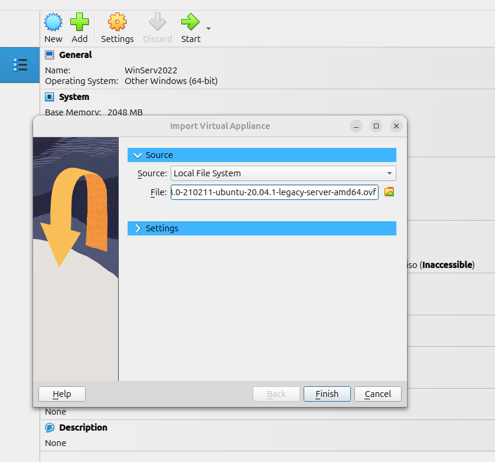

# 0. Overview
In this tutorial, we will explore Software Defined Networking (SDN) using a **Mininet** network emulator. Practical-oriented learning is one of the best ways of learning. Therefore, this tutorial follows a hands-on approach.

The tutorial contains the following: <br>
1. Introduction to SDN <br>
2. Mininet
# 1. Introduction to SDN
Switches and routers play a critical role in enterprise networks. Traditionally, these network devices have been responsible for deciding which path packets should follow, as well the actual data trasnfer (forwarding). In other words, the control and data flow functionalities of the network devices have been dealt with at each swithch and router, individually. 

While *control* refers to determining step-by-step movement of a given packet from source to destination, *forwarding* means the flow of data packets from the source to the destination. In tradtional computer networks, switches and routers are responsible for both the control and data forwarding functions. 

As shown in Figure 1, control and data planes in traditional switches are distributed across the network.
<p align="center">
  
</p>
<p align="center"><strong>Figure 1:</strong> Traditional switches with control and data planes.</p>


Notably, the control plane is distributed across the network in traditional network architecture. However, the merger of control and data forwarding planes has been found to be inefficient. Therefore, to address the limitations of network architectures based on traditional switches, Software Defined Networking (SDN) was proposed nearly two decades ago. SDN moves the control plane out of individual switches to create a centralized network control architecture. 

Figure 2 shows the separation of control and data planes in SDN based architecture. Centralized control is handled by an **SDN Controller**, which is responsible for deciding which particular paths packets take in the network. Based on routing decisions made by the SDN controller, the actual data forwarding is made by individual switches by the data plane in each.

<p align="center">
  
</p>
<p align="center"><strong>Figure 2:</strong> SDN switches with centralized control plane.</p>

In other words, all the control functionality in traditional switches has been moved to the SDN Controller. Notably, the data plane part is retained by individual switches in the network architecture. As a results, the switches in an SDN based network focus on data forwarding according to the instructions they receive from the SDN Controller.


# 2. Installing Mininet
Mininet is a network emulator software. It is used to create an SDN network using virtual hosts, switches, and SDN controller(s). Due to its ease of use and software-based implementation, Mininet is great for experimenting with SDN, OpenFlow, SDN controllers, and SDN applications. While there are also other SDN emulation software, Mininet is one of the most widely ones.

Mininet is available for common operating systems (OSes), including Linux, macOS and Windows. There are multiple ways to install Mininet in each of the OSes. Among these, the most foolproof method is to install a pre-packaged Mininet Virual Machine (VM) image in a virtualization systems such as [VirtualBox](https://www.virtualbox.org/) and [VMWare](https://www.vmware.com/). This is a Mininet tutorial for an Ubuntu Linux-based environment on VirtualBox. The steps can be adopted to other Linux distributions with minimum customization.

1. Install VirtualBox by downloading it from https://www.virtualbox.org/wiki/Linux_Downloads
Assuming the VirtualBox software is saved to **Downloads** directory in Ubuntu, use the following commands to install it.
  ```bash
  cd Downloads/ # Navigate to Downloads directory
  sudo dpkg -i virtualbox-7.1_7.1.8-168469~Ubuntu~noble_amd64.deb # Install VirtualBox VM
  ```

2. Download [Mininet VM image for Ubuntu 20.04.1](https://github.com/mininet/mininet/releases/download/2.3.0/mininet-2.3.0-210211-ubuntu-20.04.1-legacy-server-amd64-ovf.zip), which is the recommended one by the maintainers.
If you prefer any of the earlier Mininet realeases for any reason, you can download it from [Older Mininet VM image for Ubuntu](https://github.com/mininet/mininet/releases/).

3. Install Mininet in VirtualBox and setup remote access to Mininet according to the following steps.
 
 A. Import Mininet to VirtualBox (File --> Import Appliance) as shown in Figures 3. 
<figure>
<table>
  <tr>
    <td>
      <br>
    </td>
    <td>
      <br>
    </td>
  </tr>
</table>
<figcaption><strong>Figure 3: </strong> Mininet Installation in VirtualBox </figcaption>
</figure>

 B. On VirtualBox, configure the Mininet VM so that you can login to it from your local machine using **ssh**.
 While there are other ways to connect to the VM, Bridged Adapter is enables the Mininet VM to directly connect to the physical network via the host’s network card, such as Ethernet and Wi-Fi. In this way, the Mininet VM appears as a separate device on the local area network (LAN), with its own IP address.
 
 To configure a Bridged Adapter in VirtualBox, go to Settings --> Network --> Adapter 1 --> Enable Network Adapter --> Attached to --> **Bridged Adapter**.

 C. Select the Mininet VM in VirtualBox, and click **Start**.

 D. Log in to Mininet using the default log in details, using **username: mininet**, **password: mininet**. 
 
 Figure 4 shows a login screen when done on the Mininet VM directly. However, it is usually more convenient to be able to login to Mininet VM remotely. That is where remote access using **ssh** comes in.
<p align="center">
  
</p>
<p align="center"><strong>Figure 4:</strong> Mininet Local Login</p>

4. Login to Mininet remotely using **ssh**.

To do that, all that is required is to identify the IP address of the Mininet VM on the LAN. The earlier **Bridged Adapter** configuration has simplified the remote access since the Mininet VM is already part of the network.

You can use the following command to find out IP address of the Mininet VM.
```bash
  ifconfig # See and note the IP address that is not a loopback address.
  ```
Note the IP address obtained from **ifconfig** because it will be used for remote login to your Mininet VM. The computer where this tutorial was created had an IP address of **192.168.0.9**. Therefore, the same IP will be used for connecting to the Mininet VM. 
Finally, you can use **ssh** to remotely access the Mininet VM from your loacl machine.
  ```bash
  ssh -X mininet@192.168.0.9
  ```

Figure 5 shows an SSH based remote login to the Mininet VM. After typing 'yes' to confirm the connection, you will be prompted to enter the password for Mininet, which is **mininet**. If you get a screen output similar to Figure 5, the remote login to Mininet VM has been successful.
<p align="center">
  
</p>
<p align="center"><strong>Figure 5:</strong> Mininet Remote Login</p>

These basic configurations will enable you to access your Mininet VM from any computer on your local network. First, ensure the Mininet VM has been started. Second, you can login to Mininet using **ssh -X mininet@192.168.0.9** by replacing the IP address with the IP address assigned to your local Mininet VM.

# 3. Mininet Basics

Mininet is started using **mn** command on the terminal as a root user. For example, the following command displays Mininet's help message and startup options.
  ```bash
  sudo mn -h # shows Mininet’s startup options
  ```

Figure 6 shows output of the **sudo mn -h** command.
<figure>
<table>
  <tr>
    <td>
      <br>
    </td>
    <td>
      <br>
    </td>
  </tr>
</table>
<figcaption><strong>Figure 6: </strong> Output of the "sudo mn -h" command </figcaption>
</figure>

  ```bash
  sudo HOME=~ wireshark &
  ```

Alternatively, the following commnad can be used.
  ```bash
  sudo -E wireshark &
  ```

By default, Mininet comes with a minimal SDN network topology. It includes an OpenFlow switch, two hosts connected to the switch, and an OpenFlow SDN controller. Figure 7 shows the default SDN network in Mininet.
<p align="center">
  
</p>
<p align="center"><strong>Figure 6:</strong> Mininet Basic Network</p>

As shown in Figure 6, the names of the SDN Switch, Host 1, Host 2, and the SDN controller are indeed **s1**, **h1**, **h2**, and **c0**. As can be seen in Figure 7, that is indeed the case according to output of **nodes** command on Mininet's terminal.
<p align="center">
  
</p>
<p align="center"><strong>Figure 6:</strong> Nodes of Mininet's Default Network</p>

If you type **help** on the Mininet terminal, you can see what commands are available. This is handy when you want a reminder about the available options.

**Practice:**
+ From the list obtained by issuing the command **help**, run the following commands on your Mininet terminal.
```bash
  nodes
  links
  net
  ports
  pingall
  ```
+ What outputs did you get for each command?
+ Can you explain the meaning of each command's output?

<!--In addition to the **help** command, there is another way to get more information about Mininet commands. That is to use the Linux way of accessing the manual page by typing **man** followed by the command you want more information on. For example, the following command provides details about what **pingall** means in Mininet, as well as how it can be used with different command options.
-->

To test the connectivity between nodes, you can use **ping** in a similar way to how connectivity is tested in a traditional network. For example, to check if **h1** can reach **h2**, the following command can be used.
  ```bash
  h1 ping -c4 h2
  ```
Note that the option **-c4** limits the number of connectivity testing packets to **4** (i.e. **-c4** indicating count of 4). Otherwise, if you issue **h1 ping h2** instead, the test would continue nonstop until manually interrupted (with a **Ctrl C**) or the Mininet VM is stopped.

# 4. Creating Your Own Network on Mininet
  
  ## 4.1. On Mininet's Terminal
  ```bash
  sudo mn --topo=single,4
  ```

  ```bash
  sudo mn --topo=linear,4
  ```

  ```bash
  sudo mn --topo=tree,2,2
  ```

  ## 4.1. Using Python Scripts


# References
1. https://mininet.org/download/

2. https://mininet.org/walkthrough/
